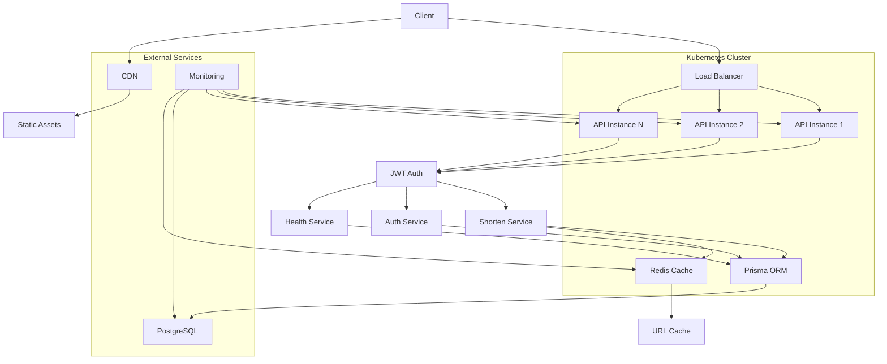

# Short-Link API

[](https://github.com/cirebox/short-link-teddy/actions/workflows/ci-cd.yml)
[](https://github.com/cirebox/short-link-teddy/actions/workflows/codeql.yml)
[](https://codecov.io/gh/cirebox/short-link-teddy)

API RESTful para encurtamento de URLs, desenvolvida com NestJS para o teste técnico da Teddy Open Finance.

## Funcionalidades

- Cadastro e autenticação de usuários (JWT)
- **Encurtamento de URLs com ou sem autenticação**
- Slugs automáticos de 6 caracteres ou aliases customizados
- CRUD para URLs de usuários autenticados
- Contagem de acessos e redirecionamento (HTTP 302)
- Soft delete para URLs
- Documentação completa com Swagger

## Tecnologias

- Node.js + NestJS
- PostgreSQL + TypeORM
- JWT para autenticação
- Docker + Docker Compose
- Jest para testes
- Swagger/OpenAPI

## Instalação e Execução

### Com Docker (Recomendado)

1. Clone o repositório
2. Execute `docker-compose up --build`
3. A API estará disponível em `http://localhost:3000`
4. Documentação Swagger em `http://localhost:3000/docs`

### Local

1. Instale Node.js e PostgreSQL
2. Configure variáveis de ambiente (veja `.env.example`)
3. Execute `npm install`
4. Execute `npm run start:dev`

## Endpoints

- `POST /auth/register` - Registro de novo usuário
- `POST /auth/login` - Login com email/password (retorna Bearer Token)
- `POST /shorten` - **Encurtar URL (com ou sem autenticação)** ⭐
- `GET /my-urls` - Listar URLs do usuário autenticado
- `PUT /my-urls` - Atualizar URL original
- `DELETE /my-urls/:id` - Soft delete da URL
- `GET /:short` - Redirecionar para URL original (público)

> ⭐ **Novidade:** O endpoint `/shorten` aceita requisições **com ou sem autenticação**. URLs autenticadas podem ser gerenciadas; URLs anônimas são permanentes. [Saiba mais](./AUTHENTICATION.md)

## Testes

```bash
npm run test
```

## Escalabilidade

### Escalabilidade Horizontal
A aplicação foi projetada para escalar horizontalmente através de múltiplas instâncias do serviço:

**Soluções Implementadas:**
- Stateless design: Todas as instâncias são idênticas e não mantêm estado local
- Load balancer (NGINX/Haproxy) para distribuição de carga entre instâncias
- Sessões JWT stateless, eliminando necessidade de sticky sessions
- Banco PostgreSQL compartilhado com connection pooling

**Desafios e Soluções:**
- **Cache de redirecionamentos:** Implementar Redis para cache de URLs frequentemente acessadas, reduzindo latência de DB
- **Rate limiting:** Usar Redis para controle de taxa por IP/usuário
- **Logs centralizados:** ELK Stack (Elasticsearch, Logstash, Kibana) para monitoramento
- **Orquestração:** Kubernetes com HPA (Horizontal Pod Autoscaler) para auto-scaling baseado em CPU/memória

### Escalabilidade Vertical
Para crescimento dentro de uma única instância:

**Otimização de Recursos:**
- Connection pooling com PostgreSQL (máx. 10 conexões por instância)
- Lazy loading e otimização de queries com TypeORM
- Compressão GZIP para respostas HTTP
- CDN (Cloudflare/AWS CloudFront) para assets estáticos

**Monitoramento:**
- Métricas com Prometheus + Grafana
- Health checks automáticos
- APM (Application Performance Monitoring) com New Relic ou similar

### Infraestrutura Recomendada
- **Desenvolvimento:** Docker Compose local
- **Staging:** Kubernetes com 2-3 réplicas
- **Produção:** Kubernetes com auto-scaling (3+ réplicas mínimas)
- **Banco:** PostgreSQL managed (AWS RDS, Google Cloud SQL) com read replicas
- **Cache:** Redis Cluster para alta disponibilidade

### Estimativa de Capacidade
- 1 instância: ~500 req/s (com cache)
- 3 instâncias: ~1500 req/s
- Com CDN + cache: 10k+ req/s para redirecionamentos

## Arquitetura



**Componentes da Arquitetura:**

- **Client**: Aplicações frontend ou APIs externas
- **Load Balancer**: Distribui requisições entre instâncias (NGINX/HAProxy)
- **API Instances**: Instâncias stateless da aplicação NestJS
- **JWT Auth**: Autenticação baseada em tokens JWT
- **Services**: Módulos de negócio (Shorten, Auth, Health)
- **Prisma ORM**: Camada de acesso a dados com PostgreSQL
- **Redis Cache**: Cache para redirecionamentos frequentes
- **CDN**: Distribuição de conteúdo estático
- **Monitoring**: Stack de observabilidade (Prometheus + Grafana)

**Fluxo de Dados:**
1. Cliente faz requisição para encurtar URL
2. Load balancer direciona para instância disponível
3. JWT validado (se autenticado)
4. Serviço de shorten processa e salva no PostgreSQL
5. Resposta retorna slug curto
6. Para redirecionamento: Cache Redis consultado primeiro, depois DB se necessário

## Project setup

```bash
$ npm install
```

## Compile and run the project

```bash
# development
$ npm run start

# watch mode
$ npm run start:dev

# production mode
$ npm run start:prod
```

## Run tests

```bash
# unit tests
$ npm run test

# e2e tests
$ npm run test:e2e

# test coverage
$ npm run test:cov
```

## CI/CD Pipeline

Este projeto utiliza GitHub Actions para automação completa de CI/CD:

### Workflows Disponíveis

- **CI/CD Pipeline** (`ci-cd.yml`): Pipeline principal com 8 jobs
  - ✅ Code Quality (ESLint + TypeScript)
  - ✅ Unit Tests (Jest + Coverage)
  - ✅ E2E Tests (com PostgreSQL)
  - ✅ Build da aplicação
  - ✅ Docker Build/Push (GHCR)
  - ✅ Security Scan (npm audit)
  - ✅ Deploy Staging (branch develop)
  - ✅ Deploy Production (branch main)

- **PR Checks** (`pr-checks.yml`): Validação de Pull Requests
  - Lint + Type-check + Tests
  - Verificação de título semântico
  - Análise de tamanho do bundle

- **Release** (`release.yml`): Automação de releases
  - Triggered por tags v*.*.*
  - Geração de changelog
  - Criação de GitHub Release
  - Tag de imagem Docker com versão

- **CodeQL** (`codeql.yml`): Análise de segurança
  - Scan semanal do código
  - Detecção de vulnerabilidades

- **Dependabot** (`.github/dependabot.yml`): Atualizações automáticas
  - Dependências npm (semanal)
  - GitHub Actions (mensal)
  - Docker base images (semanal)

### Configuração Necessária

Para ativar o pipeline completo, configure no GitHub:

1. **Secrets** (Settings → Secrets and variables → Actions):
   - `CODECOV_TOKEN`: Token do Codecov (opcional, para relatórios de cobertura)

2. **Container Registry** (já configurado para usar GHCR - GitHub Container Registry):
   - O workflow usa `ghcr.io/cirebox/short-link-teddy`
   - Permissões automáticas via `GITHUB_TOKEN`

3. **Environments** (Settings → Environments):
   - `staging`: Para deploy no ambiente de homologação
   - `production`: Para deploy em produção (adicione protection rules)

### Como Usar

- **Desenvolvimento**: Commits em `develop` → Deploy automático em staging
- **Produção**: Commits em `main` → Deploy automático em produção
- **Release**: `git tag v1.0.0 && git push origin v1.0.0` → Release completo

## Deploy em Produção

**Status:** Não foi implementado um deploy em cloud para esta entrega.

**Soluções Recomendadas:**
- **Railway**: Deploy direto do GitHub com PostgreSQL integrado
- **Render**: PaaS com suporte a Docker e PostgreSQL
- **Vercel**: Para frontend, com API Routes para backend
- **AWS/GCP/Azure**: Infraestrutura completa com Kubernetes

**Passos para Deploy:**
1. Configurar secrets no GitHub (DATABASE_URL, JWT_SECRET)
2. Escolher provedor de cloud
3. Configurar domínio e SSL
4. Executar migrations do Prisma
5. Testar endpoints

## Resources

Check out a few resources that may come in handy when working with NestJS:

- Visit the [NestJS Documentation](https://docs.nestjs.com) to learn more about the framework.
- For questions and support, please visit our [Discord channel](https://discord.gg/G7Qnnhy).
- To dive deeper and get more hands-on experience, check out our official video [courses](https://courses.nestjs.com/).
- Visualize your application graph and interact with the NestJS application in real-time using [NestJS Devtools](https://devtools.nestjs.com).
- Need help with your project (part-time to full-time)? Check out our official [enterprise support](https://enterprise.nestjs.com).
- To stay in the loop and get updates, follow us on [X](https://x.com/nestframework) and [LinkedIn](https://linkedin.com/company/nestjs).
- Looking for a job, or have a job to offer? Check out our official [Jobs board](https://jobs.nestjs.com).

## Support

Nest is an MIT-licensed open source project. It can grow thanks to the sponsors and support by the amazing backers. If you'd like to join them, please [read more here](https://docs.nestjs.com/support).

## Stay in touch

- Author - [Kamil Myśliwiec](https://twitter.com/kammysliwiec)
- Website - [https://nestjs.com](https://nestjs.com/)
- Twitter - [@nestframework](https://twitter.com/nestframework)

## License

Nest is [MIT licensed](https://github.com/nestjs/nest/blob/master/LICENSE).
