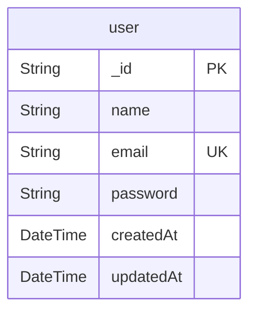
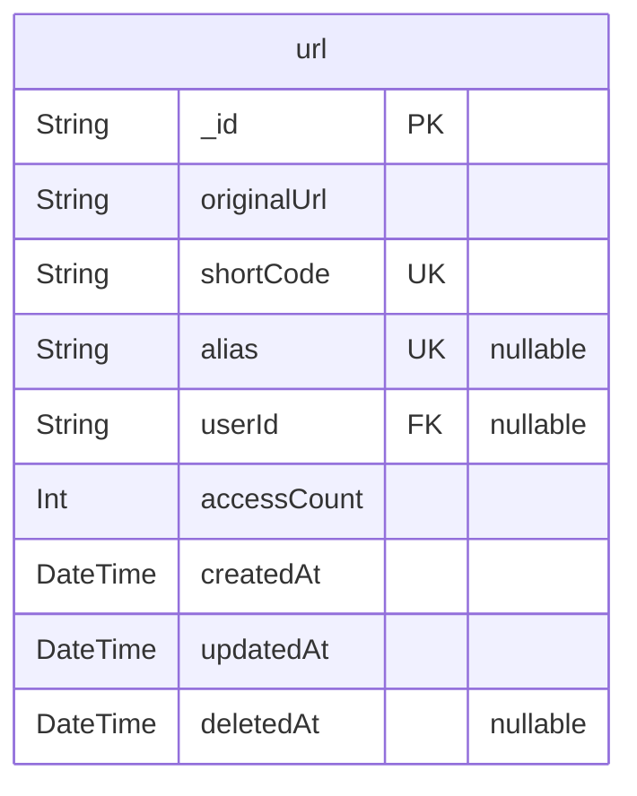

# Short Link API Database Schema
> Generated by [`prisma-markdown`](https://github.com/samchon/prisma-markdown)

- [user](#user)
- [url](#url)

## user

### `user`
Tabela de usuários do sistema.
Cada registro representa um usuário cadastrado na plataforma.

**Properties**
  - `_id`: ID único do usuário, gerado automaticamente em formato UUID.
  - `name`: Nome completo do usuário.
  - `email`: Email do usuário, deve ser único no sistema.
  - `password`: Senha do usuário, armazenada de forma criptografada.
  - `createdAt`: Data de criação do registro.
  - `updatedAt`: Data da última atualização do registro.

## url

### `url`
Tabela de URLs encurtadas.
Cada registro representa uma URL original que foi encurtada.

**Properties**
  - `_id`: ID único da URL, gerado automaticamente em formato UUID.
  - `originalUrl`: URL original que foi encurtada.
  - `shortCode`: Código curto de 6 caracteres para acesso à URL.
  - `alias`: Alias customizado opcional (3-30 caracteres, lowercase alphanumeric + hyphens/underscores).
  - `userId`: ID do usuário que criou a URL (opcional para URLs criadas sem autenticação).
  - `accessCount`: Contador de acessos à URL.
  - `createdAt`: Data de criação do registro.
  - `updatedAt`: Data da última atualização do registro.
  - `deletedAt`: Data de exclusão lógica (soft delete).